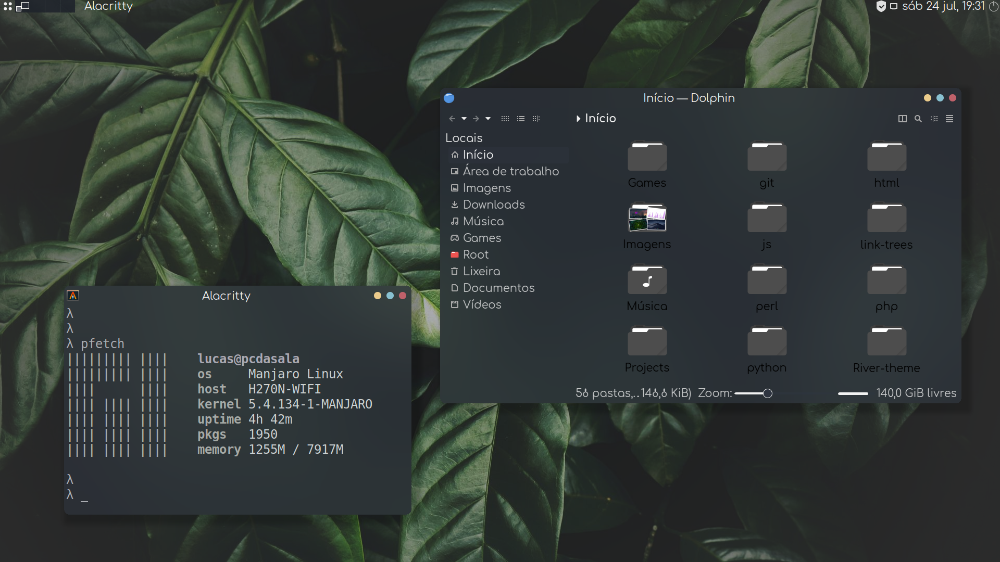
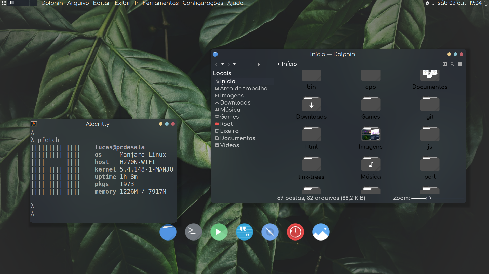
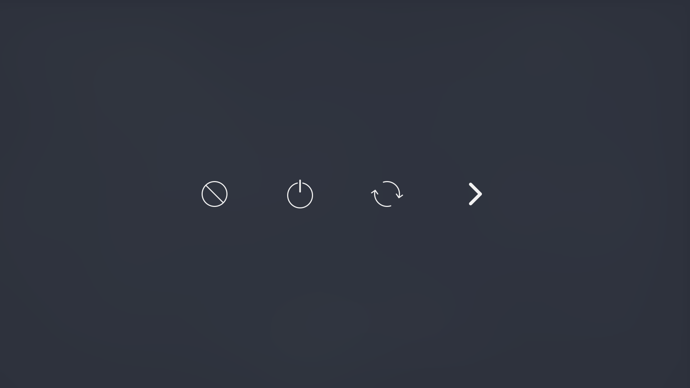
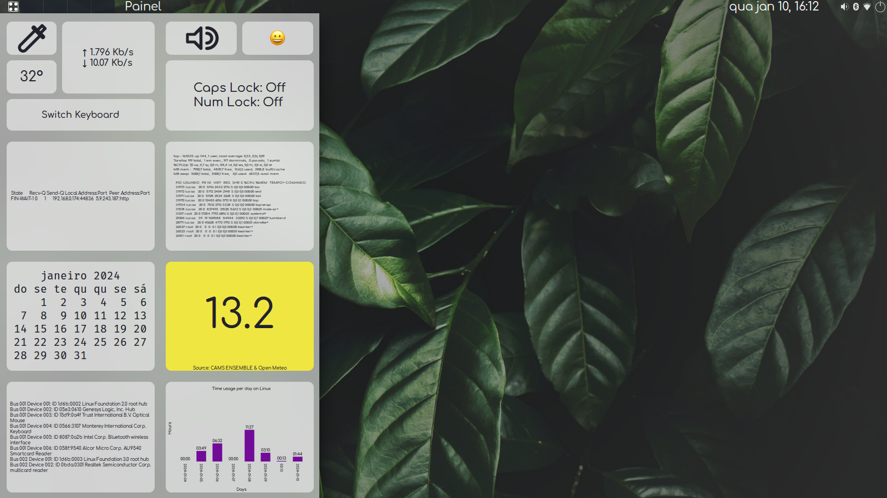

My personal desktop customization and backup. \
For now it is not completed and it is not a complete backup. \
It also includes a theme customization called River. \
The theme is based on the _Taucho_ _GTK_ theme from @emhaye, and it is based on the _Akava-Kv_ _Kvantum_ theme from @Nourepide, and probably in more code from other people. \
The theme is focused in the usage of high quality blur effect, some roundness, and consistency, with big fonts. \

It is Manjaro/Arch Mate with _Tela-circle-black-dark_ icon theme, and _Comfortaa_ and _Terminus_/_Mono_ fonts at a size of 16px/17px.

# List of Contents
- [Installation](https://github.com/Firespindash/dotfiles/tree/main#installation)
- [What is high quality blur effect?](https://github.com/Firespindash/dotfiles/tree/main#what-is-high-quality-blur-effect)
- [Background history](https://github.com/Firespindash/dotfiles/tree/main#background-history)
- [Keybindings (Shortcuts)](https://github.com/Firespindash/dotfiles/tree/main#keybindings-shortcuts)
- [Apps](https://github.com/Firespindash/dotfiles/tree/main#apps)
- [Widgets](https://github.com/Firespindash/dotfiles/tree/main#widgets)
- [Known Issues](https://github.com/Firespindash/dotfiles/tree/main#known-issues)
# Installation
Instructions to install are in the [INSTALL.md](https://github.com/Firespindash/dotfiles/blob/main/INSTALL.md) file.
# What is high quality blur effect?
It is a true blur effect that works with window background and roundness, where the windows remain with its original opacity, in general it is 1 or 100%, also can be like 0.99, while a theme provides the necessary transparency effect, creating a nice effect that you can still have a improved readability and good contrast. This means that just the background of the window has transparency applied, not the text, and not necessarily the entire window. \
This have an exception value, 0xe0000000, which can be converted to something like 0.88, I discovered it while looking into the _xcompmgr_ source code, at the **src/xcompmgr.c** file, which has this value as the Translucency constant, in my tests it turns out it is a really good number indeed for translucency. Adding up to that, it seems that recreating this effect with the dotfiles wallpaper selection is a bit harder, even requiring the usage of the value #a8000000, which converts to somewhat .66, which results in a more visual effect with these wallpapers. See below in the Background history section to know more about how I reached these numbers.
# Background history
It was actually difficult to make it, I worked on it for some months, and plan to add much more things. About the appearance it is almost done, but in terms of behavior and functionality there are ~much~ some things to do yet. During the process of doing this customization, I got sick many times, I got demotivated, because none of my friends or my parents knew that I was working on it. And I had really focus hungry things near me interrupting sometimes. That was really work intensive, so I want to take a break for a while. Nevertheless I hope this help someone when doing its own customization, or theme, or to have a better desktop experience. The actual name of the theme (River), was planned to be Rover, but it kept coming to mind when thinking about the theme development. ~~I will temporarily stop using it as a daily driver, because all the development has being done in my real machine, but now things are starting to get a bit unstable, so I want to keep the development on a Virtual Machine in the future~~, I ended up just using it all the way through and I plan to keep it in my real machine. And I plan to do an automatic installer script, also switch from _PyQt5_ to _C++_ or possibly use something like ~_Nuklear_~ _GTK_, because I discovered in the mean time that Nuklear does not really support transparency, at least it does not behave like I expected to be. \
At some point, I tried to look over other environments to migrate into, expecting to solve some inconsistencies, but them in my researches I stepped in some things that really changes everything, making _Mate_ really good yet. First, I wanted to remove CSD window decoration for more consistency between some key programs like _Gedit_ and ended up finding _gtk3-classic_, which was made to do this and integrate nicely into _Mate_, to top it off. Then, I found that I could solve the _gtk_ opaque windows inconsistency by setting `GTK_RELAX_RGBA=1`, now it works. \
After that, I really wanted to cover more programs with this problem like _Virtualbox_ and just discovered that _compton_ was the problem, I believe at least, not the window manager as I initially thought to be the cause, as I could reproduce the same effect in other desktop environment, what pointed me at the right direction. For reviewing the problem in-depth see the [yshui/picom#1048](https://github.com/yshui/picom/issues/1048) issue. The response was a close one, but not really what I expected at the beginning. So, I tried to see how old is the problem, and I could reproduce it in _xcompmgr_ the grandfather of _compton_. Because of the results, I tried looking into the much simpler source of _xcompmgr_, when compared to modern compositor at their full extent, and then I saw the Translucency base value set as a constant number, 0xe0000000, which is a hex number, indicating an ARGB value, as they, for some reason dark colors work better with blur effect, also while reading in the code I got to know better about the `_NET_WM_WINDOW_OPACITY` flag that I wish it was in the _EWMH_ standard, using it in _xprop_ with `xprop -f _NET_WM_WINDOW_OPACITY 32c -set _NET_WM_WINDOW_OPACITY 0xe0000000` produced a translucent _Virtualbox_ window, still pretty visible. Testing in my real environment, with the wallpapers present in it, I realized that the effect was reduced, as these wallpapers were made to be simple and not pull focus towards them, so I tested and reached other nice value for this case, 0xa8000000, despite being more radical and close to a value like 0x77FFFFFF, or .5, which I already knew from online research, that did not produce high quality blur effect to start with, it was a smooth value I could see the visual effect, while being able to still see things clearly over the wallpaper. Well, not a desired solution, but good. In the mean time I also learned more about _Motif_ window hints, nice to learn it too. In the end, I learned more about how things work intrinsically, and it is impressive that the best source of information I could find was someone's _C_ code. \
A small update, I passed through difficulties again while making it, the new version, version 5 was hard hitting to make, I worked for months on it, more than in other versions. I also moved to another home during the making of this version. \
Apropos, I decided to start including the version in the main commits, a version change is marked by a new wallpaper release and major changes to the code. The main trouble was making the main gem  in the sidebar widget, the user time usage metrics graphic. So many bad slept nights, many times I went to sleep late in the night because of it. My plan is to transform it in the future to a more serious program, porting it to _C_, probably, because of it I wrote it with simple commands like `expr`, without `awk`, and with plain _shell_ language. I had it there, for a bit of time, but had to do major changes in it just for it to work, the first version still exists, because it had a cache functionality not fully retained in the version 2, which made the first one faster, while broken, and with less features. It was still so complex and buggy that I made a diagram of the internal structure of the script and the diagram image has the same image resolution size of an 8K image. One of the reasons for it, is that most parts of the script, is focused in just formatting data, to more details see the [diagram](https://github.com/Firespindash/dotfiles/blob/main/bin/dev/time_usage-diagram.png). For instance, to solve this problem and solve most of the mess, the `last` command that is used, should support printing data based on periods of 1 day. I ~may try to contact~ tried to contact the current maintainer of the `last` command, to fix it. Also, in this project I got the opportunity to use chinese purple, in the graph bar color, which was a color I wanted to use somewhere, that it would be fitting, for about 2 years. The color is close to the purple color in the River color scheme, that I am yet to fully assemble. \
I finally created the **WALLPAPER.md** file aswell, the file contains instructions to improve a wallpaper for the desktop, I was not the one who created the concept, but I am probably one of the first to explain it. \
More so, it was also hard to do this widget with _eww_, still nice though, because I had to do things like an installer for it, so you can use your own applications in the action buttons without having to mess with the file, pretty different from the appbar dock widget. HINT: If you right-click the weather temperature display, you can set a custom location for the temperature display, it does change the air quality display reference location too, and if you want to have more precision you can use a coordinates polygon, see inside the [dotconfig/eww/sidemenu/scripts/air-q5y](https://github.com/Firespindash/dotfiles/blob/main/dotconfig/eww/sidemenu/scripts/air-q5y) script for more details; however this customization functionality just works once, at least for now, after that you need to change the generated **aqi-data** cache file manually, the original file is backed up; and the installer already tries to guess what temperature forecast you would be interested in, with a non-compromising precision. \
Also, while _eww_ does not really support the _GTK CSS_ variables, which is a nice new thing now, I have to deal with responsiveness myself, because of that the installer also includes instructions to adjust the significant values from the widget with a proportional ratio, because during the moving I not only passed one month and 7 or 8 days without internet, but I also changed my monitor, which was actually a TV to a real one, that is a 1600x900 resolution old monitor. I am not complaining actually, just explaining the type of things that incredibly happened during the development process, pretty impressive in my opinion. I also could not add the desired roundness to the window, I will contact _eww_ developer to see if proper window geometry shaping can be implemented, see the [dotconfig/eww/sidemenu/dev/sidemenu-mockup.svg](https://github.com/Firespindash/dotfiles/blob/main/dotconfig/eww/sidemenu/dev/sidemenu-mockup.svg) file for context. \
Continuing, I turned 18 years old before version 4, and finished school, and I forgot to give the update. Together with the others here are all the reasons to why so few commits were made during this period, between version 4 and 5. I just feel a bit relieved that I reached this milestone, still there are many things I envision for this desktop concept, there are actually little details, that I am yet to create/fix. And I now have to find a job, do something sustainable, so the next major update will not come until I manage to do it, if you want to help, please send an email to me for the details.
# Keybindings (Shortcuts)
At the moment, just a list of most common/interesting used keybindings by me. 
### Falkon
It seems that keybindings are hardcoded, can not be changed. Also, these seems to work for any browser. \
Ctrl+T -> Opens new tab. \
Ctrl+W -> Closes current tab. \
Ctrl+Shift+T -> Restores last closed tab.
### Thunar
F10 -> Creates directory. \
F2 -> Renames a file or directory.
### Extras
Ctrl+Q/Esc -> Closes almost any application. \
LWin+(Number) -> Switches to Number desktop (1-4). \
LWin+LMouseButton -> Moves a window while holding it. \
LWin+RMouseButton -> Resizes a window while holding it. \
LWin+M -> Opens _jgmenu_ desktop menu. \
LWin+L -> Opens the logout screen menu. \
Alt+F2 -> Opens _Mate_ runner popup. \
LWin+. -> Opens the emoji keyboard. \
LWin/Alt+F1 -> Opens the fullscreen application launcher. \
LWin+Right Arrow -> Opens the sidebar menu. \
LWin+Left Arrow -> Closes the sidebar menu. \
F12 -> Activates _xprop_ to do translucency in chosen window. \
Shift+F12 -> Activates _xprop_ to revert translucency effect in chosen window.
# Apps
Now I am using _FiraCode_ and _Mononoki_ fonts in the _Alacritty_ terminal version, _FiraCode_ with the code ligatures feature, and the River color scheme. The color scheme in the screenshot, the old color scheme, has its colors based on a theme that I could not find searching again, but it was a theme made by @ZB652.
# Widgets
For now there are three widgets: the dock bar, the fullscreen logout, and the sidebar menu widgets. The reason why I made the dock bar is because I have not found any other dock on my search, that could be able to be really anywhere on the screen, and mainly, able to be not just on the edge of the desktop. And at the same time, simple. Still though, the shell script containing all the functionalities has a bit more than 100 lines while being really lightweight, not consuming almost any memory. And its only dependency is _eww_ widget system, and so _Rust_. Still, it does not have fancy animations nor drag-and-drop support for a while. But it is also able of holding other types of files, not just launchers, like videos, photos, and you can add a file from any directory. The icon theme is chosen automatically, but you can change it inside the script to another theme right on its beginning. Some apps may not have an icon version matching on your theme, so you will have to tweak it manually, on the **apps.yuck** file, I recommend choosing an icon that does represent well what type of app it is. For example, I did it with my web browser _Falkon_, because it does not have a matching icon, so I changed the icon to the web browser icon, as you can see in the **apps.yuck**. I also had to change how my terminal app _Alacritty_ opens, because it was behaving differently than the expected, opening in the specific directory that the **exec** file was, in that cases you simply have to change how the app is called in the **exec** file. Mouse click opens app, right click let you edit it (add or remove app), and it does not save any changes done in the **apps.yuck** and **exec** files. \
The reason why I made the logout screen widget is because none of the logout widgets that I found, had at the same time: support for shortcuts, be capable of configuring colors and capable to go fullscreen. And I made this widget with _PyQt5_ and it has all these things. \
And the reason I created the sidebar menu is because I had the necessity to see more useful information in the desktop, not every time, but frequently, and I wanted to do it in a way I do not need to be seeing the wallpaper, that does not stay below windows. A sidebar is great, however I have not seen a widget like this, with just the bare minimum of just relevant information. Because of these reasons, here is the sidebar menu. While minimum it has everything needed, at least for me, specialized shortcut buttons, advanced hardware and network information, and it is easier to setup, having its on install script. Anyway, it does not contain a lot of redundant information, like showing the date which is shown in the top painel already, and the few that appears redundant are actually just shortcuts to information, a bit hidden, but that are still really useful. All at a keyboard shortcut of distance. It can be always there if I need it, as it overlap windows, but it also can remain hidden most of the time, which is nice for me, for a widget mainly focused in showing extra information in a clean/direct way. For instance, it shows data like open network connections and amount of bandwidth usage, most recent processes, the month calendar, air quality, outside temperature, and current usb connections. I have never seen a sidebar menu with that stuff, even though it may be only cool information to have most of the time. Regarding the shortcut buttons, I included just what I can not or that is not really pratical to put inside a painel bar, like the emoji keyboard button. 
If you want to install it, please read the INSTALL.md file.
# Known Issues
Issues that I need help to solve, or will probably get to solve one day. If you find other issues, feel free to report. 
* River _gtk_ background seems to be completely opaque in some windows. (Solved!)👍
* _mate-control-center_ background seems to not support any transparency. (Solved!)👍
* River _gtk2_ and _gtk3/4_ seems to render some assets and elements a bit different, mainly the arrows.
* River _qt_ has a problem with not drawing the borders of buttons, entries and combos, when they are disabled, it is probably just drawing a transparent color value instead of a not fully transparent one for disabled items.
* River _qt_, maybe because of my environment, seems to paint text black in some cases, probably meaning that it is using a different color scheme.
* _Metacity_ theme, or _marco_ theme, seems to have buttons slightly smaller than the ideal.
