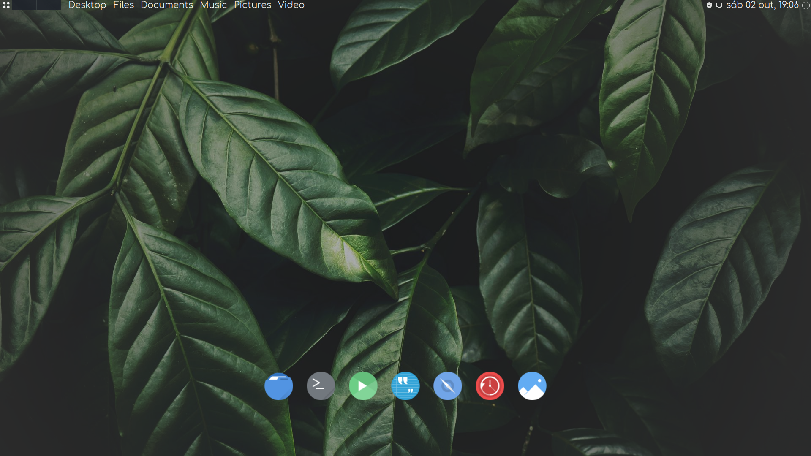

My personal desktop customization and backup. \
For now it isn't completed and it isn't a complete backup. \
It also includes a theme customization called River. \
The theme is based on the _Taucho_ _GTK_ theme from @emhaye, and it is based on the _Akava-Kv_ _Kvantum_ theme from @Nourepide, and probably in more code from other people. \
The theme is focused in the usage of high quality blur effect, some roundness, and consistency, with big fonts. \

It's Manjaro Mate with _Tela-circle-black-dark_ icon theme, and _Comfortaa_ and _Terminus_/_Mono_ fonts at a size of 16px/17px.
## What is high quality blur effect?
It is a true blur effect that works with window background and roundness, where the windows remain with its original opacity, in general it's 1 or 100%, also can be like 0.99, while a theme provides the necessary transparency effect, creating a nice effect that you can still have a improved readability and good contrast. This means that just the background of the window has transparency applied, not the text, and not necessarily the entire window. \
This have an exception value, 0xe0000000, which can be converted to something like 0.88, I discovered it while looking into the _xcompmgr_ source code, at the **src/xcompmgr.c** file, which has this value as the Translucency constant, in my tests it turns out it is a really good number indeed for translucency. Adding up to that, it seems that recreating this effect with the dotfiles wallpaper selection is a bit harder, even requiring the usage of the value #a8000000, which converts to somewhat .66, which results in a more visual effect with these wallpapers. See below in the Background history section to know more about how I reached these numbers.
## Background history
It was actually difficult to make it, I worked on it for some months, and plan to add much more things. About the appearance it is almost done, but in terms of behavior and functionality there are much to do yet. During the process of doing this customization, I got sick many times, I got demotivated, because none of my friends or my parents knew that I was working on it. And I had really focus hungry things near me interrupting sometimes. That was really work intensive, so I want to take a break for a while. Nevertheless I hope this help someone when doing it's own customization, or theme, or to have a better desktop experience. The actual name of the theme (River), was planned to be Rover, but it kept coming to mind when thinking about the theme development. ~~I will temporarily stop using it as a daily driver, because all the development has being done in my real machine, but now things are starting to get a bit unstable, so I want to keep the development on a Virtual Machine in the future~~, I ended up just using it all the way through and I plan to keep it in my real machine. And I plan to do an automatic installer script, also switch from _PyQt5_ to _C++_ or possibly use something like _Nuklear_. \
At some point, I tried to look over other environments to migrate into, expecting to solve some inconsistencies, but them in my researches I stepped in some things that really changes everything, making Mate really good yet. First, I wanted to remove CSD window decoration for more consistency between some key programs like _Gedit_ and ended up finding _gtk3-classic_, which was made to do this and integrate nicely into _Mate_, to top it off. Then, I found that I could solve the _gtk_ opaque windows inconsistency by setting `GTK_RELAX_RGBA=1`, now it works. \
After that, I really wanted to cover more programs with this problem like _Virtualbox_ and just discovered that _compton_ was the problem, I believe at least, not the window manager as I initially thought to be the cause, as I could reproduce the same effect in other desktop environment, what pointed me at the right direction. For reviewing the problem in-depth see the [yshui/picom#1048](https://github.com/yshui/picom/issues/1048) issue. The response was a close one, but not really what I expected at the beginning. So, I tried to see how old is the problem, and I could reproduce it in _xcompmgr_ the grandfather of _compton_. Because of the results, I tried looking into the much simpler source of _xcompmgr_, when compared to modern compositor at their full extent, and then I saw the Translucency base value set as a constant number, 0xe0000000, which is a hex number, indicating an ARGB value, as they, for some reason dark colors work better with blur effect, also while reading in the code I got to know better about the `_NET_WM_WINDOW_OPACITY` flag that I wish it was in the _EWMH_ standart, using it in _xprop_ with `xprop -f _NET_WM_WINDOW_OPACITY 32c -set _NET_WM_WINDOW_OPACITY 0xe0000000` produced a translucent _Virtualbox_ window, still pretty visible. Testing in my real environment, with the wallpapers present in it, I realized that the effect was reduced, as these wallpapers were made to be simple and not pull focus towards them, so I tested and reached other nice value for this case, 0xa8000000, despite being more radical and close to a value like 0x77FFFFFF, or .5, which I already knew from online research, that did not produce high quality blur effect to start with, it was a smooth value I could see the visual effect, while being able to still see things clearly over the wallpaper. Well, not a desired solution, but good. In the mean time I also learned more about _Motif_ window hints, nice to learn it too. In the end, I learned more about how things work intrinsically, and it is impressive that the best source of information I could find was someone's _C_ code.
## Keybindings (Shortcuts)
At the moment, just a list of most common/interesting used keybindings by me. 
### Falkon
It seems that keybindings are hardcoded, can't be changed. \
Ctrl+T -> Opens new tab. \
Ctrl+W -> Closes current tab. \
Ctrl+Shift+T -> Restores last closed tab.
### Thunar
F10 -> Creates directory. \
F2 -> Renames a file or directory.
### Extras
Ctrl+Q/Esc -> Closes almost any application. \
LWin+(Number) -> Switches to Number desktop (1-4). \
LWin+LMouseButton -> Moves a window while holding it. \
LWin+RMouseButton -> Resizes a window while holding it. \
LWin+M -> Opens jgmenu desktop menu. \
Alt+F2 -> Opens _Mate_ runner popup. \
LWin+. -> Opens the emoji keyboard. \
LWin/Alt+F1 -> Opens the fullscreen application launcher. \
F12 -> Activates _xprop_ to do translucency in chosen window. \
Shift+F12 -> Activates _xprop_ to revert translucency effect in chosen window.
## Apps
Now I'm using _FiraCode_ and _Mononoki_ fonts in the _Alacritty_ terminal version, _FiraCode_ with the code ligatures feature, and the _Nord_ colorscheme. The colorscheme in the screenshot, the old colorscheme, has its colors based on a theme that I couldn't find searching again, but it was a theme made by @ZB652.
## Widgets
For now there are two widgets: the dock bar, and the fullscreen logout widget. The reason why I made the dock bar is because I haven't found any other dock on my search, that could be able to be really anywhere on the screen, and mainly, able to be not just on the edge of the desktop. And at the same time, simple. The shell script containing all the functionalities has a bit more than 100 lines and it's really lightweight, not consuming almost any memory. And its only dependency is _eww_ widget system, and so _Rust_. Still it doesn't have fancy animations nor drag-and-drop support for a while. But it is also able of holding other types of files, not just launchers, like videos, photos, and you can add a file from any directory. The icon theme is chosen automatically, but you can change it inside the script to another theme right on its beginning. Some apps may not have an icon version matching on your theme, so you will have to tweak it manually, on the **apps.yuck** file, I recommend choosing an icon that does represent well what type of app it is. For example, I did it with my web browser _Falkon_, because it doesn't have a matching icon, so I changed the icon to the web browser icon, as you can see in the **apps.yuck**. I also had to change how my terminal app _Alacritty_ opens, because it was behaving differently than the expected, opening in the specific directory that the **exec** file was, in that cases you simply have to change how the app is called in the **exec** file. Mouse click opens app, right click let you edit it (add or remove app), and it doesn't save any changes done in the **apps.yuck** and **exec** files. \
The reason why I made the logout screen widget is because none of the logout widgets that I found, had at the same time: support for shortcuts, be capable of configuring colors and capable to go fullscreen. And I made this widget with _PyQt5_ and it has all these things. If you want to install it, please read the INSTALL file.
# Known Issues
Issues that I need help to solve, or will probably get to solve one day. If you find other issues, feel free to report. 
* River gtk background seems to be completely opaque in some windows. (Solved!)👍
* mate-control-center background seems to not support any transparency. (Solved!)👍
* River gtk2 and gtk3/4 seems to render some assets and elements a bit different, mainly the arrows.
* River qt has a problem with not drawing the borders of buttons, entries and combos, when they are disabled.
* River qt, maybe because of my environment, seems to paint text black in some cases, probably meaning that it's using a different color scheme.
* Metacity theme, or marco theme, seems to have buttons slightly smaller than the ideal.